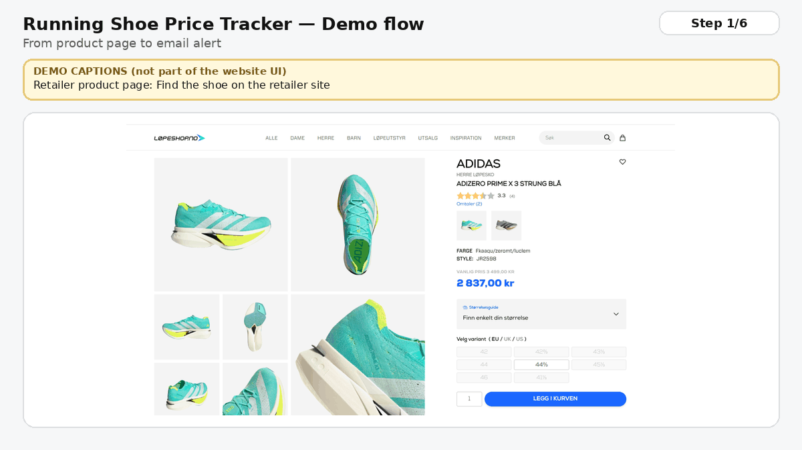

# 👟 Running Shoe Price Tracker

A production-deployed price monitoring service for running shoes. Add a product URL once, and the system automatically tracks price changes and sends an email alert when a **real** discount occurs.

From endless refreshing to one timely alert — **your size, your price, the moment it drops.**

Live frontend: https://price-tracker-web.onrender.com

---

## Demo

*Screenshots from loepeshop.no used for demo purposes.*

---

## The problem it solves

Buying running shoes at a good price is surprisingly time-consuming:

- People check the same product pages **multiple times a week** to see if a sale started
- Sizes can sell out quickly, so you keep revisiting “just in case my size is back”
- Retailer “–20%” banners can be misleading because they often compare against a short-lived, inflated reference price

This creates two hidden costs:
- **Time cost:** repeated checking adds up (attention, interruptions, decision fatigue)
- **Money cost:** you miss drops because you checked too late, or you buy too early because you got tired of waiting

This tracker removes the busywork and marketing noise by focusing on what actually matters:

**“Is it cheaper than when I started caring — and is it available in my size?”**

When you start tracking a product, the current price becomes your personal baseline. From then on:
- All price changes are measured against *your* baseline, not retailer anchors
- You get notified only when it becomes meaningfully cheaper (or meets your target)
- You can store your **size preference**, so tracking is anchored to real purchase intent

Note: the current MVP focuses on **price monitoring + alerts**. Size is stored as preference/context today; size/stock availability alerts are a natural next step.

---

## How it works

1. Add a running shoe product URL  
2. Optionally set your size and alert conditions  
3. The backend checks prices automatically on a schedule  
4. You receive an email when your condition is met (or when a real price drop happens)

No manual refreshing. No repeated “check now” clicks. Just timely alerts.

---

## Features (MVP)

### Tracking
- Add products by URL and preview the scraped title and current price
- Store an **initial price** at tracking start as a permanent baseline
- Track price history over time
- Display current price, lowest price seen, and change vs initial

### Alerts
- Per-product alert rules:
  - Target price (e.g. ≤ 2800 NOK)
  - Target discount vs initial price (e.g. ≥ 20%)
- If no rules are set, the system alerts on any real price drop
- Alerts are de-duplicated so the same price does not spam your inbox
- Emails include price context and a direct link to the product page

### Automation
- Scheduled background job performs price checks and triggers alerts
- Frontend is intentionally read-only for monitoring (no manual polling)
- A protected admin endpoint exists for maintenance/debugging (not exposed in the public UI)

---

## Tech stack

**Frontend**
- React + TypeScript (Vite)
- Recharts for price history charts

**Backend**
- Node.js + Express
- Cheerio for HTML scraping
- Scheduled jobs for automated checks
- Custom alert evaluation + email templating

**Infrastructure**
- MongoDB Atlas
- Resend (email delivery)
- Deployed on Render (static frontend + API service)

---

## MVP limitation: single-recipient alerts

This MVP is currently configured to send alert emails to a single recipient (me) via environment configuration.

A future iteration can support multiple users by adding authentication (e.g., magic link login), so each user can manage their own tracked products and receive alerts to their own email address.

---

## Status

Live MVP. Tracking, scheduled checks, and email alerts are active and working in production.

Planned next steps: UI-based alert editing, improved email summaries, broader retailer support, and size/stock availability monitoring.
